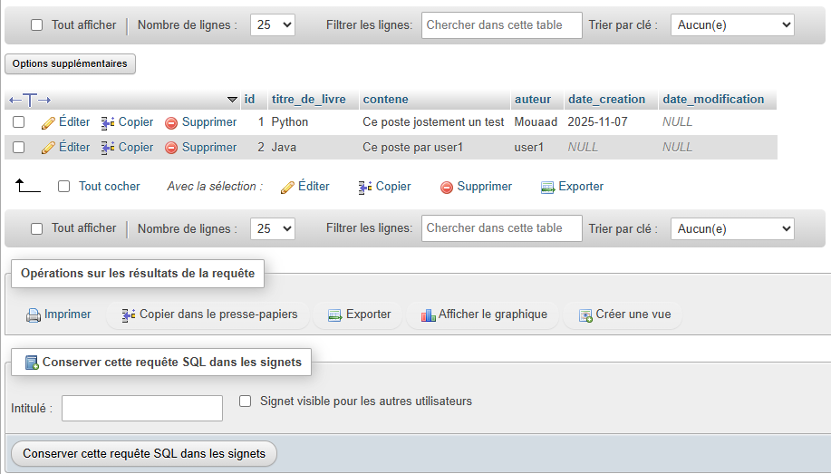
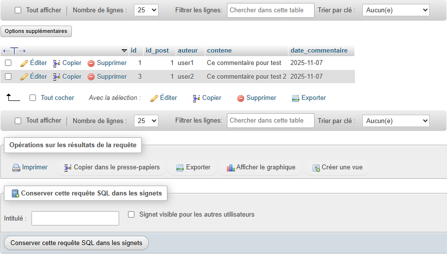
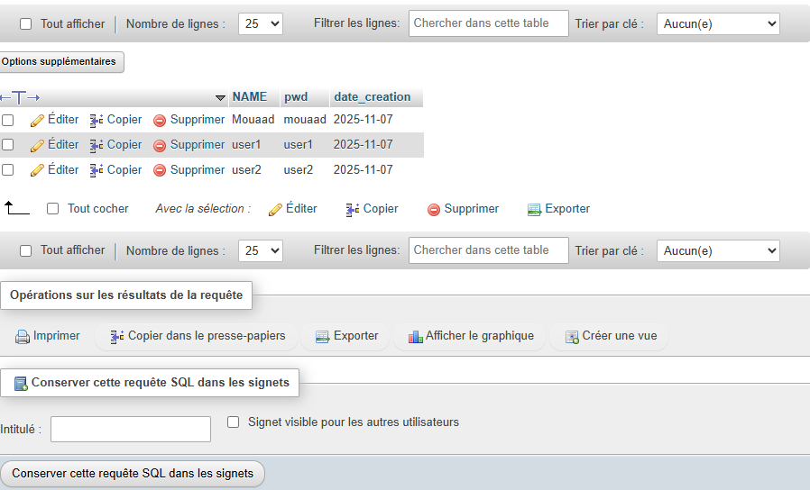
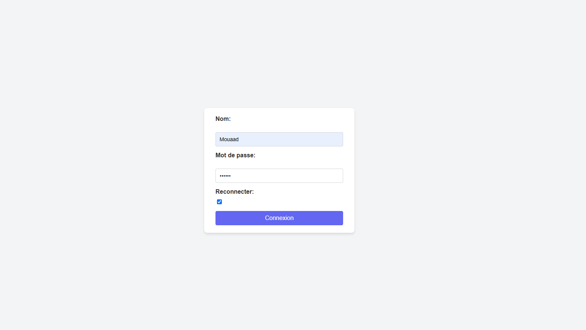
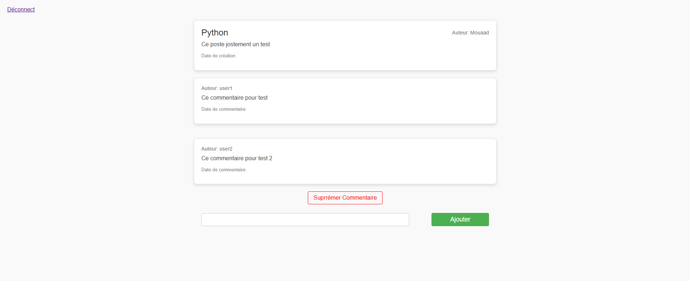

# Livre_Dor – Application Java Servlet & JSP (Livre d'or)

Une application web simple de type "livre d'or" permettant :
1. Inscription / connexion d'utilisateur (session HTTP)
2. Création, modification, suppression de posts ("paste")
3. Ajout / suppression de commentaires sur un post
4. Visualisation des listes de posts et des commentaires d'un post

## 🧱 Architecture

| Couche | Emplacement | Rôle |
|--------|-------------|------|
| Servlet Front Controller | `src/main/java/controller/servlets/ServletServer.java` | Point d'entrée unique (`/livreDor?action=...`). Dispatch des actions vers méthodes privées. |
| DAO / Services | `src/main/java/controller/dao/*.java` | Accès BD via JDBC (MySQL). Gestion des CRUD pour `Poste`, `Commentaire`, `User`. |
| Modèles | `src/main/java/model/*.java` | POJOs simples (id, champs, getters/setters). |
| Vues JSP | `src/main/webapp/view/*.jsp` | Pages dynamiques + JSTL pour afficher données et formulaires. |

Conventions importantes :
- Contexte dur : `contextPath = "http://localhost:8080/Livre_Dor"` dans `ServletServer` (penser à harmoniser ou remplacer par `request.getContextPath()` si déploiement différent).
- Typos volontaires dans la base & code : colonnes `contene`, `titre_de_livre`, table `paste`. Ne pas renommer sans mise à jour globale.
- Détection ajout vs modification d'un post : champ `idPoste` vide → création (id = 0).
- Contrôle d'"autorisation" côté JSP : `c:if test="${user.name == poste.auteur}"`.

## 🗄️ Base de données (MySQL)

Schémas (les images ci‑dessous illustrent les tables) :

```sql
CREATE TABLE paste (
	id INT AUTO_INCREMENT PRIMARY KEY,
	titre_de_livre VARCHAR(255),
	contene TEXT,
	auteur VARCHAR(100),
	date_creation DATE,
	date_modification DATE
);

CREATE TABLE commentaire (
	id INT AUTO_INCREMENT PRIMARY KEY,
	id_post INT,
	auteur VARCHAR(100),
	contene TEXT,
	date_commentaire DATE
);

CREATE TABLE user (
	name VARCHAR(100) PRIMARY KEY,
	pwd VARCHAR(255),
	date_creation DATE
);
```

| Table | Fichier image |
|-------|---------------|
| `paste` |  |
| `commentaire` |  |
| `user` |  |

Configuration JDBC : `controller/dao/Confige.java` (URL `jdbc:mysql://localhost:3306/liverdor`, user `root`, pwd vide). Adapter si nécessaire.

## 🔑 Cycle utilisateur (Login / Inscription)

Page de login : `view/login.jsp` – même formulaire pour :
- Connexion (checkbox `isExiste` cochée) → vérifie utilisateur existant via `UserService.getUser(name)`.
- Inscription (checkbox décochée) → si nom absent, insertion via `UserService.ajouterUser(user)`.



## ✍️ Posts & Commentaires

Liste des posts affichée par l'action `poste` → `postes.jsp`.


Commentaires d'un post : action `commentaires` → `commentaires.jsp`.



## 🔄 Flux des principales actions

| Action (paramètre `action`) | Méthode dans `ServletServer` | Vue / Redirection |
|------------------------------|------------------------------|-------------------|
| `login` | `login()` | `login.jsp` / liste des posts |
| `poste` | `poste()` | `postes.jsp` |
| `addPoste` | `addPoste()` | redirection vers `poste()` |
| `updatePoste` | `updatePoste()` | `form.jsp` |
| `deletePoste` | `deletePoste()` | liste des posts |
| `commentaires` | `commentaires()` | `commentaires.jsp` |
| `addCommentaire` | `addCommentaire()` | `commentaires.jsp` (même post) |
| `deleteCommentaire` | `deleteCommentaire()` | `commentaires.jsp` |
| `deconnect` | `deconnect()` | redirection vers `/livreDor` (login) |

## ⚙️ Mise en place locale rapide

1. Créer la base & tables (SQL ci‑dessus) dans MySQL (XAMPP possible).  
2. Vérifier `Confige.java` si login/pwd DB différents.  
3. Ajouter JARs dans `WEB-INF/lib` : `mysql-connector-java`, `jstl`, `jakarta.servlet-api` (Tomcat 10+).  
4. Déployer sur Tomcat sous le nom `Livre_Dor` (WAR `Livre_Dor.war`) pour correspondre au contextPath codé en dur.  
5. Accéder : `http://localhost:8080/Livre_Dor/view/login.jsp` puis créer un utilisateur ou se connecter.  

## 🧪 Tests manuels rapides

1. Inscription : décocher "Reconnecter" → saisir nom/pwd nouveaux → valider.  
2. Ajout d'un post : bouton "Ajouter un Post" → remplir → valider.  
3. Modification : lien "Modifier Poste" (visible seulement pour l'auteur).  
4. Commentaire : sur page de post → champ + bouton Ajouter.  
5. Déconnexion : lien dans `deconnecte.jsp`.  

## 🔐 Sécurité / limites actuelles

- Mots de passe non chiffrés (plain text).  
- Pas de validation côté serveur avancée (longueurs, XSS).  
- Suppression / modification basées sur le nom d'utilisateur en session (risque si session compromise).  
- Pas de pagination ni filtrage sur volume important de posts/commentaires.  

## ✅ Améliorations possibles (futures)

- Remplacer le `contextPath` hardcodé par `request.getContextPath()` partout.
- Hashage des mots de passe (BCrypt / Argon2).
- Ajouter pagination et recherches.
- Internationalisation (messages / labels).
- Passer à un build Maven/Gradle pour gestion des dépendances propre.

## 📄 Licence / Utilisation

Projet pédagogique / démonstration. Adapter librement pour expérimentation. 
---
Pour toute question ou ajout de fonctionnalité (ex: hashage des mots de passe, pagination) ouvrez une issue ou demandez une évolution.

